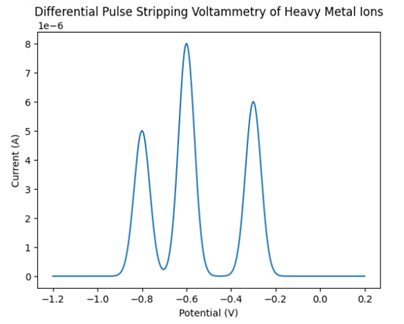

### Procedure:

● Clean the electrochemical cell and the electrodes with double distilled water.
 
● Take a 15-20 ml of water sample in the electrochemical cell.
 
● Add 2 ml of HNO3 for the digestion of organic matter present in the water sample.
 
● Add ammonium acetate buffer of pH 4.5 as an electrolyte in the solution.
 
● Before performing the experiment, attach three cords to three electrodes.
 
● Switch on the potentiostat and the module.
 
● Open the software NOVA on the computer.  

### Observations:
●	Upon application of the deposition potential, metal ions present in the water sample were preconcentrated onto the working electrode surface by reduction. 

●	During the differential pulse stripping step, well-defined current peaks were observed in the voltammogram at characteristic potentials corresponding to individual heavy metal ions ( Pb2+</sup), Cd2+, Cu2+). 

●	The peak current increased proportionally with metal ion concentration, indicating effective accumulation and stripping. 

●	The background current remained low, confirming minimal interference from the electrolyte and supporting selective metal detection. 

### Result Interpretation:
The DP stripping voltammogram (current vs potential) exhibits sharp anodic peaks at specific potentials, each representing the oxidation (stripping) of a particular heavy metal deposited on the electrode surface. The peak potential enables qualitative identification of the metal ion, while the peak current is directly proportional to its concentration in the water sample. By comparing peak currents with calibration plots obtained from standard solutions, the concentrations of heavy metal ions in the water sample can be accurately quantified. The clear peak separation and enhanced sensitivity demonstrate the suitability of differential pulse stripping voltammetry for trace-level heavy metal analysis in environmental water samples. 

  

### Precaution:
●	The DME assembly should be mounted vertically on a heavy stand to be free from vibrations. 
●	Polish the glassy carbon electrode under light pressure with an alumina slurry on a micro-cloth polishing pad using a figure 8 motion. 
●	There should be sufficient mercury in the reservoir so that the pressure changes are negligible. 

